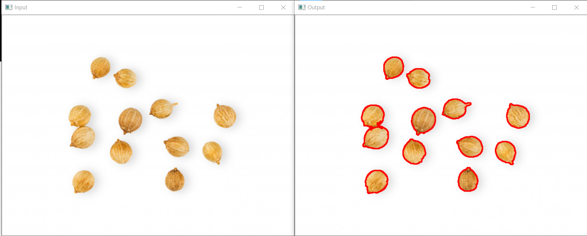

# Spurious-Seed-Detection-Segmentation

An attempt to segment out isolated seeds using contouring from a white background for using in Spurious Detection. 

The program gives the following as output :
-- A side by side display of the contour of seeds , as shown below.
-- A separate frame-by-frame display of every detected seed cropped out using masking on a black background with a white border. 

<h3>Sample Output</h3>
</img>

A different approcah can be found here : https://github.com/ritikasarkar18/Seed-Image-Segmentation
